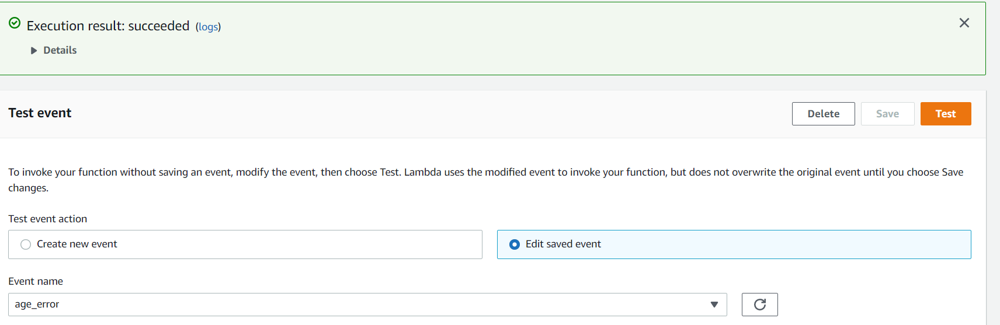
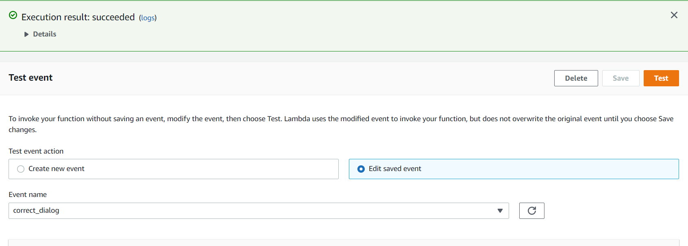
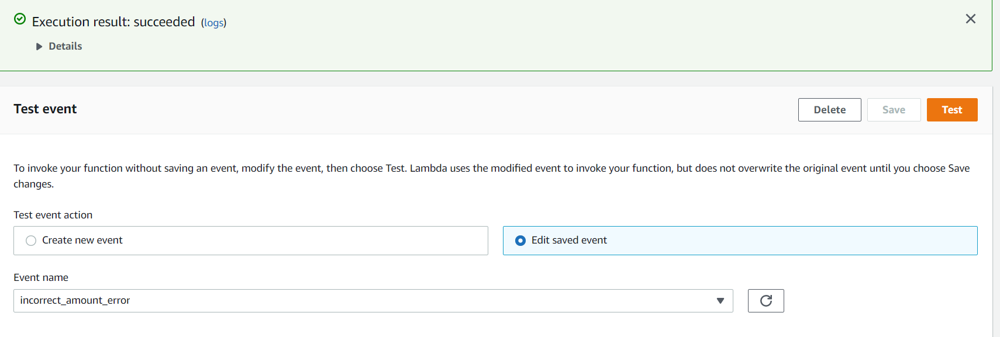
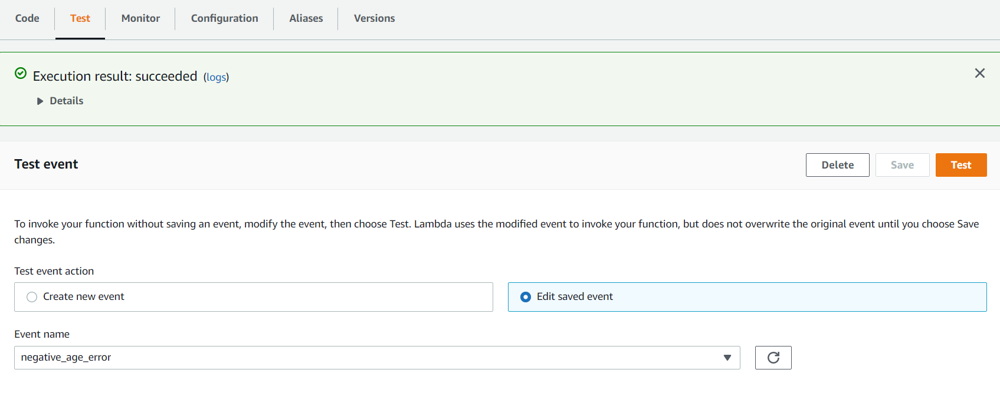
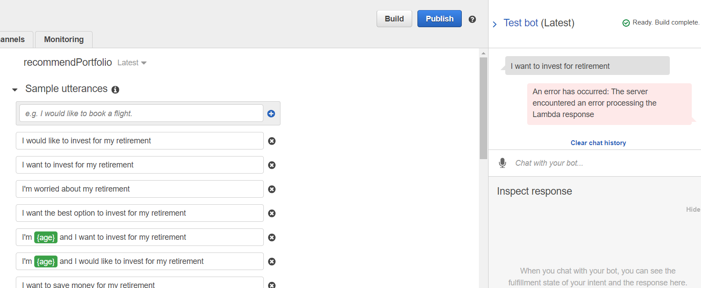

# retirement_robo_advisor2
UW Fintech Bootcamp Module 15 Challenge

---

## Technologies
  
This challenge had us using AWS Lex and Lambda to build a working investment advisor bot.    

---

## Purpose of Program

The main purpose of this project is to develop a basic understanding of the applications within the AWS ecosystem.
  
---

## Conclusions

I was able to generate a working bot as the video here shows 
 
 
 
 

https://user-images.githubusercontent.com/105887423/189181800-d08a367a-6411-4f38-9adc-56909f2af6a4.mp4

I was also able to write / update the Lambda code provided as python file and run the tests as required.  All tests passed as shown below
  
  
  
    
  
    
  
    
  
Unfortunately I was unable to get the bot and the lambda to communicate as the error below shows:  
  
    

I would like to note that this was an error that our substitute professor ran into as well and was unable to fix it during class time so, while I feel like I have followed all instructions to make this work, I have been unable to have it perform properly.  
    
---

## Contributors

The majority of this project has been done independently, with support from my tutor, Katie Kirby.

---

## License

Program is free to use without license.  Only request is that you notify author of use and application.
  
To discuss usage or general inquires please contact the author at jonm5214@gmail.com
